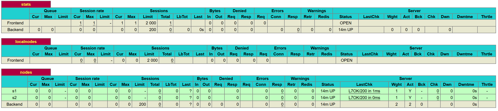
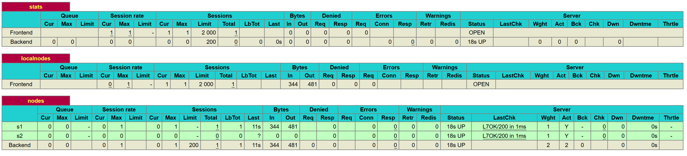
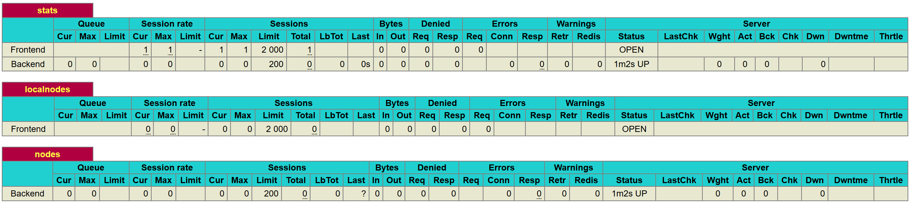
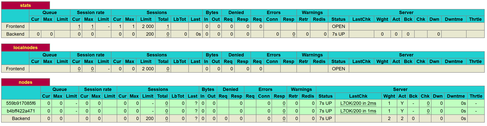
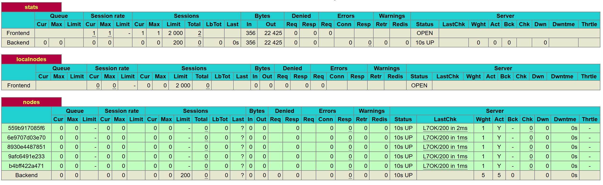
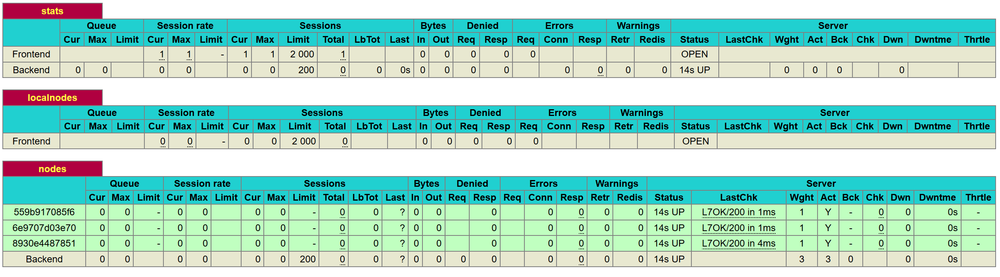

# Lab 04 - Docker - Kopp Olivier, Piller Florent

## Table of content 

1. [Introduction](#Introduction)
2. [Identify issues and install the tools](#Task-0)
3. [Add a process supervisor to run several processes](#Task-1)
4. [Add a tool to manage membership in the web server cluster](#Task-2)
5. [React to membership changes](#Task-3)
6. [Use a template engine to easily generate configuration files](#Task-4)
7. [Generate a new load balancer configuration when membership changes](#Task-5)
8. [Make the load balancer automatically reload the new configuration](#Task-6)
9. [Conclusion](#Conclusion)

## <a name="Introduction"></a>Introduction 

In this lab, we will try to improve the infrastructure of the load balancer that we began in the last one. The main goal is to provide a way to add new servers more dynamically and to have a better resistance to crashes. We will use tools such as Docker, S6, and Serf.

## <a name="Task-0"></a>Task 0 : Identify issues and install the tools 

### M1 : 

##### Do you think we can use the current solution for a production environment? What are the main problems when deploying it in a production environment?

This infrastructure can't be deployed on production. The main reasons for this is that it's pretty weak against crashes. If one of the server crash and we have to relaunch it, we also have to relaunch the HAproxy which cause an unavailability of the web app. The same process need to be done if we want to add another server.

### M2 : 

##### Describe what you need to do to add new `webapp` container to the infrastructure. Give the exact steps of what you have to do without modifiying the way the things are done. Hint: You probably have to modify some configuration and script files in a Docker image.

In order to add another webapp container, we have to build it (with the same files as the two previous containers), to modify the haproxy config file (adding the third server to the load balancing configuration)  and the run.sh script (adding the line `sed -i 's/<s3>/$S3_PORT_3000_TCP_ADDR/g' /usr/local/etc/haproxy/haproxy.cfg`). 

Next to that, we have to rebuild the haproxy image, and to run it with `docker run -d -p 80:80 -p 1936:1936 -p 9999:9999 --link s1 --link s2 --link s3 --name ha softengheigvd/ha` .

We can also modify the provision script to allows restart of the systems (adding a remove of the third webapp container and modifying the run command by the one we executed just before).

### M3 :  

##### Based on your previous answers, you have detected some issues in the current solution. Now propose a better approach at a high level.

A better approach would be to detect changes on runtime and to be able to add node to the haproxy without having to relaunch to whole infrastructure each time.

### M4 : 

##### You probably noticed that the list of web application nodes is hardcoded in the load balancer configuration. How can we manage the web app nodes in a more dynamic fashion?

It should be possible to add or remove the nodes dynamically, without knowing their names or addresses. One solutions is to create a cluster where all nodes communicate, which will allow the haproxy to know which node are actives at any times.

### M5 : 

##### In the physical or virtual machines of a typical infrastructure we tend to have not only one main process (like the web server or the load balancer) running, but a few additional processes on the side to perform management tasks. 

##### Do you think our current solution is able to run additional management processes beside the main web server / load balancer process in a container? If no, what is missing / required to reach the goal? If yes, how to proceed to run for example a log forwarding process?

The basic use of docker container doesn't allows the execution of multiple process, once the main process stops, the container is killed. What we need to achieve is to have another abstract layer such as a process supervisor, which will always be running and will launch and monitor other processes.

### M6 : 

##### In our current solution, although the load balancer configuration is changing dynamically, it doesn't follow dynamically the configuration of our distributed system when web servers are added or removed. If we take a closer look at the `run.sh` script, we see two calls to `sed` which will replace two lines in the `haproxy.cfg` configuration file just before we start `haproxy`. You clearly see that the configuration file has two lines and the script will replace these two lines.

##### What happens if we add more web server nodes? Do you think it is really dynamic? It's far away from being a dynamic configuration. Can you propose a solution to solve this?

If we add other nodes, we will also have to add them in the haproxy configuration file. This is not dynamic. A solution to this problem would be to run a script at each change in the network, which will do modification of the different configuration files.

##### Stats page : 



repository at https://github.com/olivierKopp/Teaching-HEIGVD-AIT-2016-Labo-Docker.git

## <a name="Task-1"></a>Task 1 : Add a process supervisor to run several processes

Stats page at the end of the manipulations : 



We didn't have particular difficulties in this task.

During this task, we modified the configuration of the docker images in order to install a process supervisor which will allow us to run multiple process within the same container easily. The process supervisor will help us to manage the processes inside the docker containers. For example, if a web application crashes, it can restart it for us.

## <a name="Task-2"></a>Task 2 : Add a tool to manage membership in the web server cluster

#### Provide the docker log output for each of the containers: `ha`,`s1` and `s2`. 

- [HA logs](https://github.com/olivierKopp/Teaching-HEIGVD-AIT-2016-Labo-Docker/blob/master/logs/task2/logs_HA.txt)
- [S1 logs](https://github.com/olivierKopp/Teaching-HEIGVD-AIT-2016-Labo-Docker/blob/master/logs/task2/logs_S1.txt)
- [S2 logs](https://github.com/olivierKopp/Teaching-HEIGVD-AIT-2016-Labo-Docker/blob/master/logs/task2/logs_S2.txt)


#### Problem with the current solution : 

The current problem is that if one of the webapp failed to join the cluster, his agent startup will fail (it's the case if a webapp is launch before the haproxy). To prevent that, we can add the -retry-join option to the agent.

The documentation show the usage of that option : 

[`-retry-join`](https://www.serf.io/docs/agent/options.html#retry-join) - Address of another agent to join after starting up. This can be specified multiple times to specify multiple agents to join. If Serf is unable to join with any of the specified addresses, the agent will retry the join every `-retry-interval` up to `-retry-max` attempts. This can be used instead of `-join` to continue attempting to join the cluster.

#### Give an explanation on how `Serf` is working. Try to find other solutions that can be used to solve similar situations where we need some auto-discovery mechanism.

Serf is a tool for cluster membership, failure detection, and orchestration that is decentralized, fault-tolerant and highly available. It is extremely lightweight: it uses 5 to 10 MB of resident memory and primarily communicates using infrequent UDP messages.

Serf uses an efficient [gossip protocol](https://www.serf.io/docs/internals/gossip.html) to solve three major problems:

- **Membership**: Serf maintains cluster membership lists and is able to execute custom handler scripts when that membership changes.
- **Failure detection and recovery**: Serf automatically detects failed nodes within seconds, notifies the rest of the cluster, and executes handler scripts allowing you to handle these events. Serf will attempt to recover failed nodes by reconnecting to them periodically.
- **Custom event propagation**: Serf can broadcast custom events and queries to the cluster. These can be used to trigger deploys, propagate configuration, etc. Events are simply fire-and-forget broadcast, and Serf makes a best effort to deliver messages in the face of offline nodes or network partitions. Queries provide a simple realtime request/response mechanism.

Other solutions can be ZooKeeper, doozerd or etcd, which uses a client/server architecture and required the usage of libraries to be used.

## <a name="Task-3"></a>Task 3 : React to membership changes

#### Logs captured during the manipulation : 

- [HA logs with only HA running](https://github.com/olivierKopp/Teaching-HEIGVD-AIT-2016-Labo-Docker/blob/master/logs/task3/logs_only_HA.log)
- [S1 logs with HA running](https://github.com/olivierKopp/Teaching-HEIGVD-AIT-2016-Labo-Docker/blob/master/logs/task3/logs_S1_with_HA_up.log)
- [HA logs after starting S1](https://github.com/olivierKopp/Teaching-HEIGVD-AIT-2016-Labo-Docker/blob/master/logs/task3/logs_HA_after_starting_S1.log)
- [S2 logs with HA and S1 running](https://github.com/olivierKopp/Teaching-HEIGVD-AIT-2016-Labo-Docker/blob/master/logs/task3/logs_S2_with_HA_and_S1_up.log)
- [File serf.log in HaProxy](https://github.com/olivierKopp/Teaching-HEIGVD-AIT-2016-Labo-Docker/blob/master/logs/task3/serf.log)

## <a name="Task-4"></a>Task 4 : Use a template engine to easily generate configuration files

#### You probably noticed when we added `xz-utils`, we have to rebuild the whole image which took some time. What can we do to mitigate that? Take a look at the Docker documentation on [image layers](https://docs.docker.com/engine/userguide/storagedriver/imagesandcontainers/#images-and-layers). Tell us about the pros and cons to merge as much as possible of the command. In other words, compare:

```
RUN command 1
RUN command 2
RUN command 3
```

#### vs.

```
RUN command 1 && command 2 && command 3
```

#### There are also some articles about techniques to reduce the image size. Try to find them. They are talking about `squashing` or `flattening` images.

Merging command allows us to create images with less layers (each line in the dockerfile will create a layer). This means that the performance of our image will be better if we merge command. On the other hand, docker use a cache to store the result of each command. This means that if we add a new line in the first architecture (the non merge one) the cache will improve the speed of building of the image, because every command that didn't change won't be executed. If we use the second architecture, the cache will be called only one time, so for each change in the line, every command will be executed, ignoring the cache.

The goal of the squashing is to reduce the size and the number of the layers in a docker image without losing the benefit of the caching. src : http://jasonwilder.com/blog/2014/08/19/squashing-docker-images/

The flattening is use on docker container instead of docker image, it aims to reduce the size of the container by deleting the history of it. src : https://tuhrig.de/flatten-a-docker-container-or-image/

#### Propose a different approach to architecture our images to be able to reuse as much as possible what we have done. Your proposition should also try to avoid as much as possible repetitions between your images.
We can create a base image which contain every shared dependencies that our backend and haproxy need (i.e : basic tools, serf, S6...) and make the dockerfile of HA and servers inherit from it.

#### Provide the `/tmp/haproxy.cfg` file generated in the `ha` container after each step.  Place the output into the `logs` folder like you already did for the Docker logs in the previous tasks. Three files are expected.

- [Config after starting HA](https://github.com/olivierKopp/Teaching-HEIGVD-AIT-2016-Labo-Docker/blob/master/logs/task4/configFiles/config_after_starting_HA.log)
- [Config after starting S1](https://github.com/olivierKopp/Teaching-HEIGVD-AIT-2016-Labo-Docker/blob/master/logs/task4/configFiles/config_after_starting_S1.log)
- [Config after starting S2](https://github.com/olivierKopp/Teaching-HEIGVD-AIT-2016-Labo-Docker/blob/master/logs/task4/configFiles/config_after_starting_S2.log)

#### In addition, provide a log file containing the output of the `docker ps` console and another file (per container) with `docker inspect <container>`. Four files are expected.

- [Docker ps logs](https://github.com/olivierKopp/Teaching-HEIGVD-AIT-2016-Labo-Docker/blob/master/logs/task4/docker_ps_logs.log)
- [Docker inspect HA logs](https://github.com/olivierKopp/Teaching-HEIGVD-AIT-2016-Labo-Docker/blob/master/logs/task4/docker_inspect_HA_logs.log)
- [Docker inspect S1 logs](https://github.com/olivierKopp/Teaching-HEIGVD-AIT-2016-Labo-Docker/blob/master/logs/task4/docker_inspect_S1_logs.log)
- [Docker inspect S2 logs](https://github.com/olivierKopp/Teaching-HEIGVD-AIT-2016-Labo-Docker/blob/master/logs/task4/docker_inspect_S2_logs.log)

#### Based on the three output files you have collected, what can you say about the way we generate it? What is the problem if any?

The file contains the name and ip of the last member that has joined the cluster. 

## <a name="Task-5"></a>Task 5 : Generate a new load balancer configuration when membership changes

#### Provide the file `/usr/local/etc/haproxy/haproxy.cfg` generated in the `ha` container after each step. Three files are expected.

- [Config after starting HA](https://github.com/olivierKopp/Teaching-HEIGVD-AIT-2016-Labo-Docker/blob/master/logs/task5/configFiles/config_after_starting_HA.log)
- [Config after starting S1](https://github.com/olivierKopp/Teaching-HEIGVD-AIT-2016-Labo-Docker/blob/master/logs/task5/configFiles/config_after_starting_S1.log)
- [Config after starting S2](https://github.com/olivierKopp/Teaching-HEIGVD-AIT-2016-Labo-Docker/blob/master/logs/task5/configFiles/config_after_starting_S2.log)

#### In addition, provide a log file containing the output of the`docker ps` console and another file (per container) with`docker inspect <container>`. Four files are expected.

- [Docker ps logs](https://github.com/olivierKopp/Teaching-HEIGVD-AIT-2016-Labo-Docker/blob/master/logs/task5/docker_ps_logs.log)
- [Docker inspect HA logs](https://github.com/olivierKopp/Teaching-HEIGVD-AIT-2016-Labo-Docker/blob/master/logs/task5/docker_inspect_HA_logs.log)
- [Docker inspect S1 logs](https://github.com/olivierKopp/Teaching-HEIGVD-AIT-2016-Labo-Docker/blob/master/logs/task5/docker_inspect_S1_logs.log)
- [Docker inspect S2 logs](https://github.com/olivierKopp/Teaching-HEIGVD-AIT-2016-Labo-Docker/blob/master/logs/task5/docker_inspect_S2_logs.log)

#### Provide the list of files from the `/nodes` folder inside the `ha` container. One file expected with the command output.

[List of nodes with all container up](https://github.com/olivierKopp/Teaching-HEIGVD-AIT-2016-Labo-Docker/blob/master/logs/task5/list_of_nodes_with_HA_S1_S2.log)

#### Provide the configuration file after you stopped one container and the list of nodes present in the `/nodes` folder. One file expected with the command output. Two files are expected.

- [Config after stopping S2](https://github.com/olivierKopp/Teaching-HEIGVD-AIT-2016-Labo-Docker/blob/master/logs/task5/configFiles/config_after_stopping_S2.log)
- [List of nodes after stopping S2](https://github.com/olivierKopp/Teaching-HEIGVD-AIT-2016-Labo-Docker/blob/master/logs/task5/list_of_nodes_after_stopping_S2.log)

#### In addition, provide a log file containing the output of the `docker ps` console. One file expected.

[Docker ps after stopping S2](https://github.com/olivierKopp/Teaching-HEIGVD-AIT-2016-Labo-Docker/blob/master/logs/task5/docker_ps__after_stopping_S2_logs.log)

#### (Optional:) Propose a different approach to manage the list of backend nodes. You do not need to implement it. You can also propose your own tools or the ones you discovered online. In that case, do not forget to cite your references.

## <a name="Task-6"></a>Task 6 : Make the load balancer automatically reload the new configuration

#### Experimentation : 

1. We launch the HAProxy : 

   [Docker ps step1](https://github.com/olivierKopp/Teaching-HEIGVD-AIT-2016-Labo-Docker/blob/master/logs/task6/docker_ps__step1.log)

   Stats page :

   

2.  We launch two backend servers named S1 and S2 : 

   [Docker ps step2](https://github.com/olivierKopp/Teaching-HEIGVD-AIT-2016-Labo-Docker/blob/master/logs/task6/docker_ps__step2.log)

   Stats page :

   

3. We launch three other server named S3, S4 and S5 : 

   [Docker ps step3](https://github.com/olivierKopp/Teaching-HEIGVD-AIT-2016-Labo-Docker/blob/master/logs/task6/docker_ps__step3.log)

   Stats page :

   

4. We stop the servers S1 and S3 : 

   [Docker ps step4](https://github.com/olivierKopp/Teaching-HEIGVD-AIT-2016-Labo-Docker/blob/master/logs/task6/docker_ps__step4.log)

   Stats page :

   

   We have indeed a dynamic load balancer that can be used in a production environment with a great scalability.

#### Give your own feelings about the final solution. Propose improvements or ways to do the things differently. If any, provide references to your readings for the improvements.

This solutions is pretty good, be we could improve it. Indeed, it is easy to launch new back end server but we still have to do it manually, we could imagine a way to launch automatically new node as soon as the traffic become higher and kill node when the traffic is lower and nobody has an active session on a particular node. For example amazon provide ways to create auto scaling groups that can be combined with load balancers. (https://aws.amazon.com/autoscaling/?nc1=h_ls)

## <a name="Conclusion"></a>Conclusion

This lab allowed us to better understand the usage of docker, especially the notion of process supervisor and layers. We also learn the basic usage of Serf, a tool that allows node to communicate between each other. Eventually, this was a good way to discover an example of load balancing in a production environment.